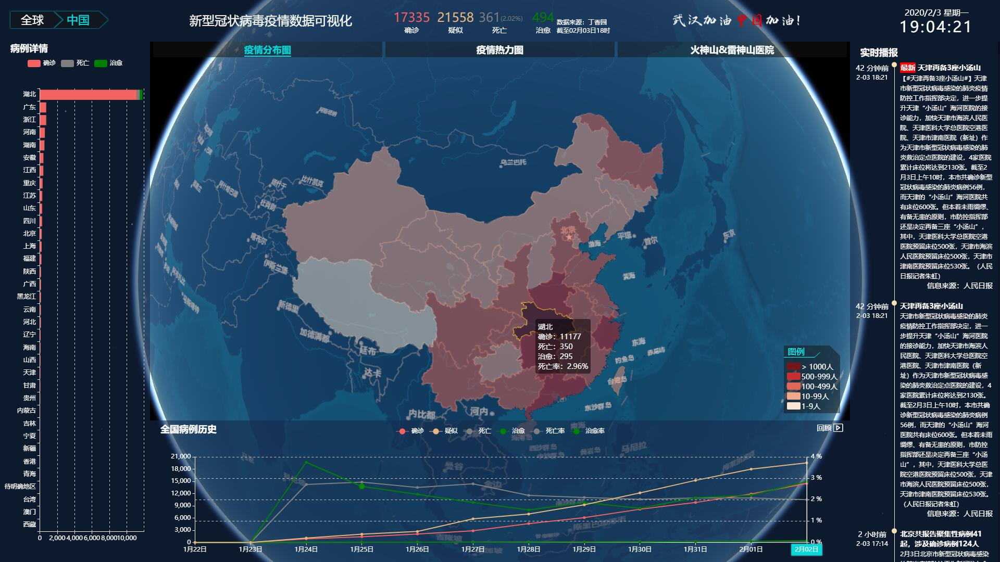

# 2019-nCov-3D

> 2019 nCoV 三维可视化

## Build Setup

``` bash
# 安装依赖
npm install

# 调试运行 at localhost:8080
npm run dev

# 编译
npm run build

```
[在线示例](http://ncov.earthsdk.com)


2019年年末发生在中国武汉的新型冠状病毒疫情肆虐

顶栏是数据总览

左侧是当前地理范围的分区域详情图表

右侧是当前地理范围的新闻列表

下侧是数据的时序详情，同时也包括了历史回放控制

中间为三维地图
地图表现方式：
一，全球柱状图

二，全国和分省的面着色


三，全国城市热力图

四，医院建设直播

三维地图基于 [earthsdk](http://www.earthsdk.com)

